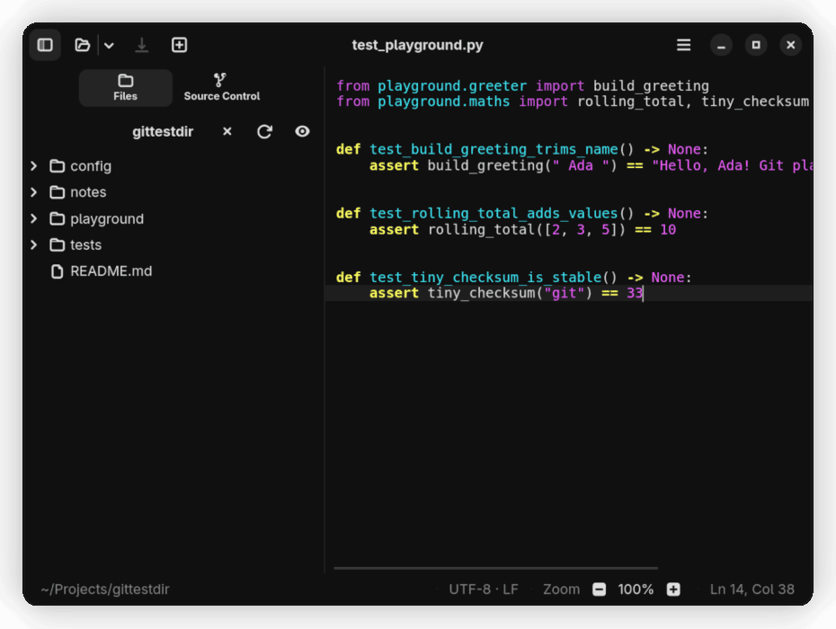

# Riteed



Riteed is a small native GNOME text editor written in Rust. The current source
version is `0.3.8`, an early public beta. It is useful for daily local editing
and compare work, but it is not feature complete.

The application lives under `app/`. The repository root also contains the
roadmap, policy, and validation tooling used to keep the app strict, native,
and Flatpak-first.

## Status

- Early beta: expect rough edges and missing features.
- Released as source through `v0.3.8`; no stable `1.0` yet and no Flathub
  submission.
- A self-updating beta Flatpak channel is published directly from this
  repository through GitHub Pages.
- Target platform: GNOME on Linux, packaged through Flatpak.
- External tester feedback welcome; primary maintainer remains the main user.

## Features

- Tabbed editing for local text, code, config, and Markdown files.
- GtkSourceView syntax highlighting with editor palette selection.
- Find and Replace plus project-wide Find in Files, with results in a sticky
  Search Results sidebar page (`Ctrl+F`, `Ctrl+H`, `Ctrl+Shift+F`).
- Optional line numbers, optional minimap, and zoom controls.
- Encoding-aware open/save behavior with line-ending controls.
- Native Markdown preview for `.md` and `.markdown` files using CommonMark
  with YAML frontmatter, safe placeholders for images and raw HTML, and no
  browser engine.
- Multi-page preferences for General, Editor, Appearance, Format, and Source
  Control.
- English and Danish localization with an in-app language choice
  (System / English / Danish), applied on next restart.
- Session restore, recent files, guarded reload prompts, autosave for writable
  saved files, and large-file safety limits.
- Lightweight folder sidebar with lazy file browsing, hidden-file toggle,
  refresh, and tab/tree reveal.
- Compare workflows for saved versions, files, pasted text, and Git changes
  with both adaptive split and unified diff layouts.
- Polished diffs with syntax highlighting, original-line gutters, inline token
  highlights, full-row changed backgrounds, filler hatching, and collapsed
  unchanged regions.
- Multi-file Source Control review tabs for staged and unstaged changes with
  a Change List navigator and Open Reviewed File action.
- Local-only Source Control sidebar with Git status, file badges,
  stage/unstage, safe discard, Git compare, recent commit history, and commits.
- Bundled sandbox-local Git for Flatpak builds; Riteed does not call host Git.

## What Riteed Is Not Yet

- Not a full IDE.
- No push, pull, branch management, merge editor, terminal, debugger, or LSP.
- No external beta program yet.
- No stable API or release promise before `1.0`.

## Layout

- `app/` - Riteed application source, resources, metadata, tests, and Flatpak
  Cargo source manifest. Includes `app/fuzz/` as an independent nested
  workspace for cargo-fuzz targets.
- `docs/` - screenshots, stress-test plan and implementation report, and
  working notes.
- `stress/` - corpus generator, JSON stress scripts, Git stress repositories,
  and Valgrind suppressions used by the `riteed-stress` developer binary and
  the nightly stress CI job.
- `policy/` - machine-readable policy files used to validate the app.
- `tools/` - hard-fail validation tooling.
- `scripts/` - thin wrappers around the root tooling plus small maintenance
  scripts.
- `AGENTS.md` - repository-wide contract for app and policy work.
- `ROADMAP.md` - milestone plan through V16; V14.5 is next.
- `VERSIONS.md` - versioning rules for this repository.
- `CHANGELOG.md` - notable repository changes.
- `THIRD_PARTY_LICENSES.md` - license notes for vendored and bundled
  third-party components.

## Application Stack

Riteed is intentionally narrow and GNOME-native:

- Rust 1.95
- GTK 4 bindings for Rust
- libadwaita
- GtkSourceView
- `pulldown-cmark` + `yaml-rust2` for the native Markdown preview
- GNU gettext localization
- GSettings-backed preferences
- Flatpak-first packaging and sandboxing

## Validate Riteed

Run validation from the repository root and point the root tooling at `app/`:

```bash
python3 -m tools.policy_check --root app --strict
python3 -m tools.coverage_check --root app
```

Direct app checks can still be run from `app/`:

```bash
cd app
cargo fmt --all --check
cargo check --workspace --all-targets --all-features
cargo clippy --workspace --all-targets --all-features -- -D warnings
GTK_A11Y=none GSK_RENDERER=cairo G_DEBUG=fatal-criticals \
  cargo test --workspace --all-targets --all-features
```

Direct metadata and Flatpak checks:

```bash
glib-compile-schemas --strict --dry-run app/data/schemas
msgfmt --check-format --check-header -o /dev/null app/po/*.po
desktop-file-validate app/data/io.github.cadric.Riteed.desktop
appstreamcli validate --no-net --pedantic \
  app/data/io.github.cadric.Riteed.metainfo.xml
flatpak-builder --show-manifest \
  app/build-aux/io.github.cadric.Riteed.yml
```

Build the local Flatpak from the repository root:

```bash
flatpak-builder --user --install --force-clean \
  app/build-dir app/build-aux/io.github.cadric.Riteed.yml
flatpak run io.github.cadric.Riteed
```

GitHub Actions validates the root tooling, the app subtree, GTK tests with
`G_DEBUG=fatal-criticals`, and a full Flatpak build.

## Install the Beta Flatpak

Riteed is not on Flathub yet. Beta Flatpak updates are published from the
project's GitHub Pages Flatpak repository.

Install from the beta ref:

```bash
flatpak install --user \
  https://cadric.github.io/riteed/flatpak/io.github.cadric.Riteed.flatpakref
```

Explicit remote setup:

```bash
flatpak remote-add --user --if-not-exists riteed-beta \
  https://cadric.github.io/riteed/flatpak/riteed-beta.flatpakrepo
flatpak install --user riteed-beta io.github.cadric.Riteed//beta
```

Update:

```bash
flatpak update --user io.github.cadric.Riteed
```

The beta remote signing key fingerprint is:

```text
1A04 CECD 3576 716F F309  0D27 5D2C 311E 81B8 5DC6
```

See `app/build-aux/flatpak/README.md` for the beta remote metadata and key
rotation note.

## Stress Testing

Riteed has a layered stress-test setup for boundary caps, parser robustness,
and large-file flows. See `docs/stress-test-plan.md` for the full plan and
`docs/stresstest_rapport.md` for the current implementation status.

The `app/fuzz/` workspace holds cargo-fuzz targets for the Markdown, Git
status, and diff parsers. Local runs require a nightly Rust toolchain:

```bash
cd app/fuzz
cargo +nightly fuzz run markdown_parse -- -max_total_time=60
```

The `riteed-stress` developer binary drives the app through JSON flow scripts
under `stress/scripts/`. It is feature-gated and never built into the Flatpak
release:

```bash
cd app
cargo build --bin riteed-stress --features stress
GSETTINGS_SCHEMA_DIR="$(realpath build-dir/files/share/glib-2.0/schemas)" \
RITEED_STRESS_SCRIPT=../stress/scripts/open-save-search.json \
  ./target/debug/riteed-stress
```

The full stress suite (proptest, cargo-fuzz, Git stress repos, Flatpak stress
smoke) runs as a scheduled GitHub Actions job and can also be triggered
manually.

## License

Riteed's own source code and repository policy/tooling are licensed under the
MIT License; see `LICENSE`.

Cargo dependencies are pinned in `app/Cargo.lock`; the Flatpak build downloads
the locked crate archives listed in `app/build-aux/cargo/cargo-sources.json`
into a build-local `cargo/vendor/` tree. Local `app/vendor/` directories are
ignored and must not be committed.

The `app/fuzz/` workspace pins its own dependencies in `app/fuzz/Cargo.lock`;
those crates are only built when running fuzz targets locally and are not
included in the Flatpak release artifact.

The Flatpak manifest also bundles a trimmed local-plumbing Git binary for the
Source Control sidebar. Git is distributed under GPL-2.0-only overall and
contains some files under LGPL-2.1-or-later, BSD-3-Clause, and MIT-compatible
terms. The Flatpak build installs the relevant Git license texts under
`/app/share/licenses/io.github.cadric.Riteed/`.

See `THIRD_PARTY_LICENSES.md` for the current license review.
